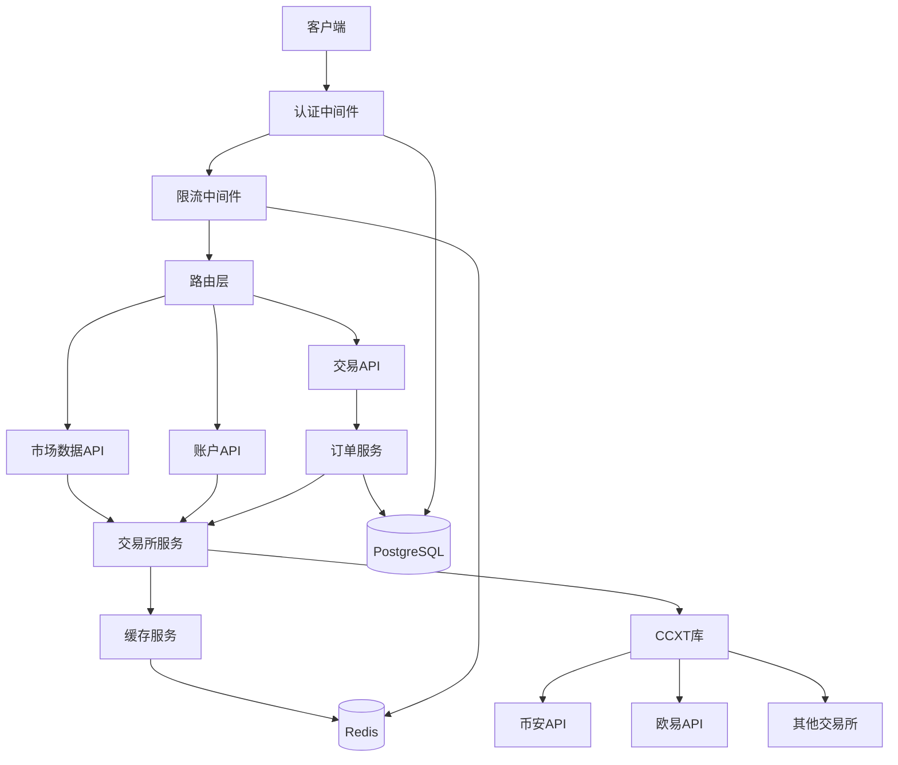

# 设计文档

## 概述

数字货币交易接口系统是一个基于Fastify + PostgreSQL + Redis + ccxt + pino的极小规模交易API系统。该系统提供统一的REST API接口，支持多个数字货币交易所的市场数据查询、订单管理和账户操作，同时通过Redis缓存和HMAC-SHA256认证确保高性能和安全性。

系统采用微服务架构设计，将功能模块化为独立的服务层，包括交易所服务、缓存服务、订单服务等，便于维护和扩展。

## 架构

### 整体架构



### 技术栈

- **Web框架**: Fastify (高性能Node.js框架)
- **数据库**: PostgreSQL (关系型数据库，用于订单和用户数据)
- **缓存**: Redis (内存缓存，用于市场数据和限流)
- **交易所接口**: ccxt (统一的交易所API库)
- **日志**: pino (高性能结构化日志)
- **部署**: Docker + docker-compose

## 组件和接口

### 核心服务组件

#### 1. ExchangeService (交易所服务)
负责与各个交易所API的交互，提供统一的接口封装。

**主要方法:**
- `getTicker(symbol: string)`: 获取行情数据
- `getOrderBook(symbol: string, limit?: number)`: 获取订单簿深度
- `getKlines(symbol: string, timeframe: string, limit?: number)`: 获取K线数据
- `createOrder(params: OrderParams)`: 创建订单
- `cancelOrder(orderId: string)`: 取消订单
- `fetchBalance(userId: number)`: 查询余额
- `fetchOrder(orderId: string)`: 查询订单状态

**错误处理策略:**
- 网络超时: 指数退避重试，最多3次
- 限流错误: 等待后重试
- 余额不足: 直接返回错误
- 其他错误: 记录日志并抛出

#### 2. CacheService (缓存服务)
封装Redis操作，提供高性能的数据缓存。

**缓存策略:**
- 行情数据 (TTL: 5秒)
- 深度数据 (TTL: 3秒)  
- K线数据 (TTL: 1分钟)
- 用户余额 (TTL: 30秒)
- 用户信息 (TTL: 5分钟)

**主要方法:**
- `get(key: string)`: 获取缓存
- `set(key: string, value: any, ttl: number)`: 设置缓存
- `del(key: string)`: 删除缓存
- `increment(key: string, ttl: number)`: 计数器操作

#### 3. OrderService (订单服务)
处理订单相关的业务逻辑和数据库操作。

**主要功能:**
- 订单创建和验证
- 订单状态同步
- 订单历史查询
- 数据库事务管理

#### 4. AuthService (认证服务)
实现HMAC-SHA256签名认证机制。

**认证流程:**
1. 验证时间戳窗口 (5分钟)
2. 从缓存/数据库获取用户密钥
3. 重新计算签名并比对
4. 提取用户权限信息

### API接口设计

#### 公开接口 (无需认证)
```
GET /api/v1/ping                    # 健康检查
GET /api/v1/time                    # 服务器时间
GET /api/v1/exchanges               # 支持的交易所列表
GET /api/v1/market/ticker/:symbol   # 行情数据
GET /api/v1/market/depth/:symbol    # 订单簿深度
GET /api/v1/market/klines/:symbol   # K线数据
```

#### 私有接口 (需要认证)
```
POST /api/v1/trade/order           # 创建订单
DELETE /api/v1/trade/order/:id     # 取消订单
GET /api/v1/trade/order/:id        # 查询订单
GET /api/v1/trade/orders           # 订单列表
GET /api/v1/account/balance        # 余额查询
GET /api/v1/account/info           # 账户信息
```

### 中间件组件

#### 1. 认证中间件 (auth.ts)
- HMAC-SHA256签名验证
- 时间戳窗口检查
- 用户权限提取

#### 2. 限流中间件 (rateLimit.ts)
- 基于Redis计数器的限流
- 支持全局和用户级别限制
- 端点特定限流规则

## 数据模型

### 数据库表结构

#### users (用户表)
```sql
CREATE TABLE users (
    id SERIAL PRIMARY KEY,
    api_key VARCHAR(64) UNIQUE NOT NULL,
    api_secret VARCHAR(128) NOT NULL,
    exchange VARCHAR(20) NOT NULL,
    exchange_api_key TEXT,
    exchange_secret TEXT,
    permissions JSONB DEFAULT '["read"]',
    status VARCHAR(20) DEFAULT 'active',
    created_at TIMESTAMP DEFAULT NOW()
);
```

#### orders (订单表)
```sql
CREATE TABLE orders (
    id BIGSERIAL PRIMARY KEY,
    user_id INTEGER REFERENCES users(id),
    exchange VARCHAR(20) NOT NULL,
    exchange_order_id VARCHAR(100),
    symbol VARCHAR(20) NOT NULL,
    side VARCHAR(10) NOT NULL,
    type VARCHAR(20) NOT NULL,
    price DECIMAL(20, 8),
    amount DECIMAL(20, 8) NOT NULL,
    filled DECIMAL(20, 8) DEFAULT 0,
    status VARCHAR(20) DEFAULT 'pending',
    fee DECIMAL(20, 8),
    fee_currency VARCHAR(10),
    error TEXT,
    created_at TIMESTAMP DEFAULT NOW(),
    updated_at TIMESTAMP DEFAULT NOW()
);
```

#### balance_snapshots (余额快照表)
```sql
CREATE TABLE balance_snapshots (
    id BIGSERIAL PRIMARY KEY,
    user_id INTEGER REFERENCES users(id),
    exchange VARCHAR(20) NOT NULL,
    balances JSONB NOT NULL,
    created_at TIMESTAMP DEFAULT NOW()
);
```

#### api_logs (API日志表)
```sql
CREATE TABLE api_logs (
    id BIGSERIAL PRIMARY KEY,
    user_id INTEGER,
    endpoint VARCHAR(100) NOT NULL,
    method VARCHAR(10) NOT NULL,
    status_code INTEGER,
    response_time INTEGER,
    error TEXT,
    created_at TIMESTAMP DEFAULT NOW()
);
```

### Redis缓存键命名规范

```
# 行情数据
ticker:{exchange}:{symbol}

# 深度数据  
depth:{exchange}:{symbol}

# K线数据
kline:{exchange}:{symbol}:{interval}

# 交易对列表
symbols:{exchange}

# 用户余额
balance:{userId}:{exchange}

# 限流计数器
ratelimit:{userId}:{endpoint}

# 用户信息
user:{apiKey}
```

## 正确性属性

*属性是应该在系统的所有有效执行中保持为真的特征或行为——本质上是关于系统应该做什么的正式声明。属性作为人类可读规范和机器可验证正确性保证之间的桥梁。*

### 属性 1: 认证签名验证
*对于任何*有效的API密钥和请求数据，使用正确的密钥生成签名然后验证签名应该返回成功
**验证需求: 需求 1.4**

### 属性 2: 认证时间窗口
*对于任何*超出5分钟窗口的时间戳，认证应该被拒绝
**验证需求: 需求 1.5**

### 属性 3: 市场数据格式一致性
*对于任何*有效的交易对，行情数据响应应该包含价格、买价、卖价和成交量字段
**验证需求: 需求 2.1**

### 属性 4: 缓存命中行为
*对于任何*已缓存且未过期的数据，系统应该从缓存返回数据而不调用外部API
**验证需求: 需求 2.4**

### 属性 5: 订单数据持久化
*对于任何*成功创建的订单，数据库中应该存在包含所有必需字段的对应记录
**验证需求: 需求 3.5**

### 属性 6: 订单状态同步
*对于任何*取消的订单，系统状态和数据库记录应该反映取消状态
**验证需求: 需求 3.2**

### 属性 7: 余额查询格式
*对于任何*用户的余额查询，响应应该包含所有数字货币的余额信息
**验证需求: 需求 4.1**

### 属性 8: 限流拒绝行为
*对于任何*超过定义限制的请求序列，系统应该以HTTP 429状态拒绝超限请求
**验证需求: 需求 5.1**

### 属性 9: 请求日志记录
*对于任何*API请求，系统应该记录包含端点、响应时间和状态码的日志条目
**验证需求: 需求 5.2**

### 属性 10: 结构化日志格式
*对于任何*系统事件，生成的日志应该是有效的JSON格式
**验证需求: 需求 6.1**

### 属性 11: 数据加密往返
*对于任何*敏感数据，加密后解密应该得到原始数据
**验证需求: 需求 7.3**

## 错误处理

### 错误分类和处理策略

#### 1. 网络错误
- **超时错误**: 指数退避重试，最多3次
- **连接错误**: 记录错误并返回服务不可用
- **DNS解析错误**: 记录错误并使用缓存数据

#### 2. 交易所API错误
- **限流错误**: 等待指定时间后重试
- **认证错误**: 记录错误并返回认证失败
- **余额不足**: 直接返回错误，不重试
- **订单不存在**: 返回订单未找到错误

#### 3. 数据库错误
- **连接错误**: 使用连接池重试
- **约束违反**: 返回数据验证错误
- **事务冲突**: 重试事务

#### 4. 缓存错误
- **Redis连接错误**: 降级到直接调用数据源
- **缓存过期**: 刷新缓存并返回新数据

### 错误响应格式

```json
{
  "success": false,
  "error": {
    "code": "INSUFFICIENT_BALANCE",
    "message": "余额不足",
    "details": {
      "required": "100.00",
      "available": "50.00",
      "currency": "USDT"
    }
  },
  "timestamp": 1702567890000
}
```

## 测试策略

### 双重测试方法

系统将采用单元测试和基于属性的测试相结合的方法：

- **单元测试**: 验证特定示例、边界情况和错误条件
- **基于属性的测试**: 验证应该在所有输入中保持的通用属性

两种测试方法是互补的：单元测试捕获具体的错误，基于属性的测试验证通用正确性。

### 单元测试

单元测试将覆盖：
- 特定的示例，展示正确的行为
- 组件之间的集成点
- 边界条件和错误处理

### 基于属性的测试

**测试库**: 使用 `fast-check` 库进行基于属性的测试
**测试配置**: 每个属性测试运行最少100次迭代
**测试标记**: 每个基于属性的测试必须使用以下格式标记：
`**Feature: crypto-trading-api, Property {number}: {property_text}**`

基于属性的测试将验证设计文档中定义的所有正确性属性，确保系统在各种输入条件下的正确行为。

### 测试覆盖范围

- **API端点测试**: 所有公开和私有API端点
- **认证测试**: HMAC签名验证和时间窗口检查
- **缓存测试**: 缓存命中、过期和刷新逻辑
- **数据库测试**: 数据持久化和查询操作
- **错误处理测试**: 各种错误场景的处理
- **限流测试**: 请求频率限制和计数器管理